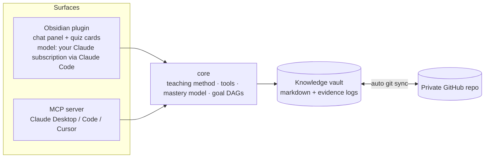

# Groundwork

A tutor that plans any learning goal from first principles, calibrates what you actually know with quizzes, and **remembers it** — in a private GitHub repo that is also an Obsidian vault, so the same memory follows you to every computer and every chat app.

You talk to it **inside Obsidian** (a chat panel with native LaTeX, callouts, highlights, mermaid, and clickable quiz cards), or from **any MCP chat client** (Claude Desktop, Claude Code, Cursor) against the same vault.

Inspired by [amosblomqvist/learn](https://github.com/amosblomqvist/learn): the teaching method — unconditional truths first, "how could I have discovered this?", probe → plan → teach, diagnostic quizzes — comes from there. What changes:

| `learn` | Groundwork |
| --- | --- |
| TUI on one side, Obsidian mirroring a log file on the other | One surface: the chat lives *in* Obsidian and renders natively. `groundwork open` launches everything. |
| Memory is the current session | Persistent, calibrated memory: every quiz answer is evidence; per-concept mastery, forgetting, and misconceptions are recomputed from it. |
| Tied to one project directory | A private git repo synced automatically (pull on open, debounced commit + push after changes), merge-safe across machines. |
| pi-only | Obsidian plugin **and** an MCP server, sharing one core. |

## How it works



**The vault** (an Obsidian vault and a git repo):

```
concepts/Derivative.md          one note per concept; `prerequisites: ["[[Limit]]", …]`
goals/Understand the derivative.md   objective + auto-generated dependency map + progress table
sessions/2026-09-28 ….md        transcript and summary of each session
resources/HW2.md                files you attach: lectures, homeworks, study guides, practice exams
exams/Prepare for the midterm.md  topics + required depth parsed from those files
learner.md                      your background and how you learn best (the tutor reads + appends)
.groundwork/evidence/*.jsonl    append-only quiz evidence: the source of truth
.groundwork/chats/*.json        chat history, so sessions resume on any machine
```

Because prerequisites are wikilinks, Obsidian's graph view *is* your dependency graph (colored by status). Concepts are shared across goals, so learning "Chain rule" for one goal counts toward every other goal that needs it.

**The session shape** the tutor follows (see `packages/core/src/prompt.ts`):

0. **Recall** — read the vault first. Solid + recent concepts aren't re-probed; rusty ones get a quick review; open misconceptions get dislodged.
1. **Probe** — quizzes that bracket the edge of your understanding on every prerequisite strand (a floor you get right *and* a ceiling you miss). Plus plain questions about what you actually want.
2. **Plan** — a dependency DAG from caveat-free truths up to your goal, saved to `goals/` and shown as a map. It waits for your go-ahead.
3. **Teach** — node by node: motivate → establish → connect → quiz-check, updating concept notes as it goes.

**Exam prep** is the same loop, pointed at *their* files. Attach lecture slides, a couple of homeworks, a study guide, or a practice exam (paperclip, paste, or drop onto the tutor). Groundwork classifies each file, pulls out the topics and the level the exam seems to demand (the same 1–5 scale as quizzes: recognize → apply → combine → transfer), writes `exams/…`, and opens a goal so teaching starts at that depth. Homeworks say what is practiced; a practice exam or study guide says what is sufficient. The tutor still reads the files and can refine the plan (`ingest_exam_materials`).

**The calibration model** (`packages/core/src/model.ts`). Each concept's state is a pure function of its evidence log, so merged logs from two machines converge to the same numbers:

- *Ability* θ on a logit scale (Rasch/Elo). A question of difficulty $d \in 1..5$ has $P(\text{correct}) = \sigma(\theta - (d-3))$; each answer moves θ by $K(\text{outcome} - P)$, with $K$ shrinking as evidence accumulates.
- *Memory half-life* $h$: spaced successes grow it, crammed ones barely do, misses shrink it. Retention $R = 2^{-\Delta t / h}$.
- *Now* = ability discounted by forgetting. Status is `solid` / `shaky` / `learning` / `rusty` (was solid, decayed — review due) / `unassessed`.
- The *edge*: highest difficulty answered correctly (floor) and lowest missed (ceiling).
- *Misconceptions*: each distractor can carry the belief that would lead someone to pick it. Choosing it records that misconception on the concept until a correct answer at that level retires it. "I don't know" is recorded as an honest gap, never as a misconception.

## Setup

**Quick setup:** clone this repo and run `python setup.py` (same as `python setup_groundwork.py`; on Windows, `py setup.py`; get Python with `winget install Python.Python.3.12` if you don't have it). It installs git, Node, Obsidian, Claude Code, and optionally the GitHub CLI; signs you in; builds and links `groundwork`; creates or clones your vault; and opens Obsidian. If Groundwork is already installed, the same command `git pull`s this repo and rebuilds. Flags: `--new NAME` or `--clone URL` to skip the vault question, `--vault DIR`, `--no-open`, `--no-pull`, `-y`. The manual steps are below.

Requires Node 20+, git, [Obsidian](https://obsidian.md) (desktop), and [Claude Code](https://claude.com/claude-code) signed in with your Claude subscription (see [Connect a model](#connect-a-model-your-claude-subscription-default)). `npm install` also downloads Claude Code's binary for the tests (~240 MB). The plugin uses the Claude Code you install yourself, not that copy.

```bash
git clone <this repo> groundwork && cd groundwork
npm install
npm run build
npm link -w packages/cli        # puts `groundwork` on your PATH
```

### First computer: create your knowledge vault

```bash
# creates ~/Groundwork, a private GitHub repo (needs the gh CLI), installs the plugin, opens Obsidian
groundwork init ~/Groundwork --github my-knowledge
```

No `gh`? Create an empty private repo on GitHub and use `--remote git@github.com:you/my-knowledge.git` instead.

### Every other computer

```bash
groundwork clone git@github.com:you/my-knowledge.git
```

### Day to day: one command

```bash
groundwork open
```

It pulls the latest knowledge, updates the plugin inside the vault, registers the vault with Obsidian, and launches it with the tutor panel open. From then on the plugin syncs by itself (pull on open and every 10 minutes; commit + push 30 s after the tutor changes anything). The plugin is committed into the vault, so a plain `git clone` + opening the folder in Obsidian also works.

The **first time** you open the vault on a machine, Obsidian asks you to *Trust author and enable plugins*, and (in Obsidian 1.13+) to *Allow* mermaid diagrams. Both are one click.

### Connect a model: your Claude subscription (default)

The tutor runs through [Claude Code](https://claude.com/claude-code), so it uses your Claude Pro/Max plan and needs no API key. Once per computer:

```bash
curl -fsSL https://claude.ai/install.sh | bash     # Windows (PowerShell): irm https://claude.ai/install.ps1 | iex
claude                                             # first run asks you to log in; or type /login
```

Then in Obsidian: **Settings → Groundwork → Check connection** should say *Signed in as …* and list the models your plan can use. Groundwork finds `claude` on your PATH and in the usual install folders (`~/.local/bin`, `~/.claude/local`, Homebrew). If it doesn't, paste the output of `which claude` into **Claude Code executable**.

How it works: the plugin starts Claude Code with the Agent SDK, replaces Claude Code's system prompt with the tutor's, turns off all of Claude Code's own tools (no file edits or shell), and hands it Groundwork's tools as an in-process MCP server, so quiz cards still appear in the panel. `ANTHROPIC_API_KEY` is removed from Claude Code's environment so it always uses your subscription login. Claude Code keeps chat sessions on the machine that ran them. When you continue a chat on another computer, the tutor gets the transcript instead.

This is meant for your own use with your own login. Don't ship it to other people as a product that signs in with claude.ai accounts.

**Alternatives** (Settings → Groundwork → Provider):
- **Anthropic API key**: the key is stored in this device's local storage, **not** in the vault, so it is never pushed to GitHub.
- **Demo**: a scripted lesson on the derivative that exercises everything (recall, plan with a map, LaTeX, quizzes that update the vault, session summary) without calling any model.

Web search (optional) lets the tutor verify facts: Claude Code's WebSearch/WebFetch tools on the subscription, or Anthropic's web search tool with an API key.

### Files: attach them, or keep them in `resources/`

Attach files to a message with the paperclip (**Upload from this computer** or **Choose from the vault**). You can also paste an image into the message box, drag files onto the panel (from your desktop or Obsidian's file explorer), or link a vault file in your message, like `[[Lecture 3.pdf]]`. Uploads are saved to the vault's `resources/` folder, so they sync to your other computers and stay linked from the session note.

The tutor reads images (PNG, JPEG, GIF, WebP), PDFs, and text files (markdown, code, CSV, LaTeX, …). It can also look in `resources/` on its own (`list_vault_files`, `read_vault_file`): drop your lecture notes or textbook there and say "use my lecture 3 notes". With the Claude subscription, long PDFs are read with Claude Code's `Read` tool, which can go page by page. That tool is limited to the vault folder. Limits: 50 MB per upload (the vault is a git repo), and images must be under 5 MB and PDFs under 20 MB to be sent inline. Saved chats don't store file contents, only the paths.

### Use it from Claude Desktop, Claude Code, or Cursor

```bash
groundwork connect claude-desktop   # or: claude-code, cursor, print
```

Then ask the assistant to teach you something (or use the `teach` / `review` prompts). The server tells the model to load your learner state and the teaching method first. Quizzes appear as an inline form when the client supports MCP elicitation; otherwise the model shows lettered options in chat and the **server** grades your reply (`submit_quiz_answer`), so the vault stays calibrated either way. It commits and pushes after changes, just like the plugin.

## CLI reference

| Command | What it does |
| --- | --- |
| `groundwork init [dir] [--github name \| --remote url] [--no-open]` | Create a vault, git repo, and (optionally) private GitHub repo; install the plugin; open Obsidian |
| `groundwork clone <url> [dir]` | Set up an existing vault on this machine |
| `groundwork open [--vault dir]` | Pull, update the plugin, open Obsidian |
| `groundwork mcp [--vault dir] [--no-sync]` | Run the MCP server over stdio |
| `groundwork connect <client>` | Register the MCP server with `claude-desktop`, `claude-code`, `cursor`, or `print` the JSON |
| `groundwork sync` · `groundwork status` · `groundwork install-plugin` | Sync now · summary of what you know · reinstall the plugin |

The default vault is saved in `~/.config/groundwork/config.json`; override with `--vault` or `GROUNDWORK_VAULT`. `OBSIDIAN_BIN` overrides how Obsidian is launched (e.g. an AppImage path).

## Repo layout

```
packages/core             vault store, mastery model, goal DAGs, quiz grading, tools, teaching prompt, agent loop, git sync
packages/obsidian-plugin  chat panel, quiz/question cards, settings, auto-sync
packages/cli              `groundwork` CLI and MCP server (bundles the plugin)
```

## Development

```bash
npm test                 # vitest: model, store, quiz grading, agent loop, two-machine git merge, MCP end-to-end,
                         # and the Claude Code session driving the real binary against a mock Messages API
npm run typecheck
npm run build            # plugin → packages/obsidian-plugin/dist, CLI → packages/cli/dist
npm run dev:plugin       # rebuild the plugin on change; then `groundwork install-plugin` and reload Obsidian
```

Sync details: evidence logs use git's `union` merge driver (`.gitattributes`), so both machines' answers survive a merge. Prose conflicts prefer the local side. After any merge that brings in changes, every concept's stats and every goal map are rebuilt from the merged evidence.

## Not built yet

- **claude.ai on the web / phone** — needs a hosted remote MCP server that talks to the GitHub repo through the API instead of a local clone.
- **Obsidian mobile** — the plugin is desktop-only because sync shells out to git.
- **Generated visuals** — the reference system's SVG/mermaid maker subagents. For now the tutor writes mermaid inline and goal maps are generated.
