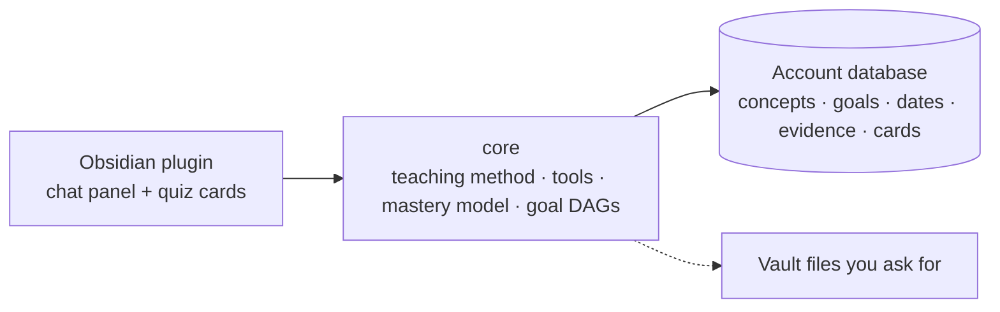

# Developing Groundwork

Consumer install is in the [README](../README.md). This page is the clone, CLI, and repo layout.

Groundwork plans a learning goal from first principles, calibrates what you know with quizzes, and remembers it on the Groundwork account. Obsidian is the window. The vault only holds files you explicitly ask to be written there.

The chat lives in Obsidian and renders natively (LaTeX, callouts, highlights, mermaid, quiz cards). Inspired by [amosblomqvist/learn](https://github.com/amosblomqvist/learn). Groundwork is [MIT licensed](../LICENSE).

## Setup

**Quick setup:** clone this repo and run `python setup.py` (same as `python setup_groundwork.py`; on Windows, `py setup.py`; get Python with `winget install Python.Python.3.12` if you don't have it). It installs git, Node, Obsidian, Claude Code, and optionally the GitHub CLI; signs you in; builds and links `groundwork`; creates or clones your vault; and opens Obsidian. Flags: `--new NAME` or `--clone URL` to skip the vault question, `--vault DIR`, `--no-open`, `--no-pull`, `-y`.

**Update later** with `python update.py` (or `python update_groundwork.py`). That pulls this repo, rebuilds, and refreshes the plugin in the vault you already configured. It does not ask you to create or clone a vault.

Requires Node 20+, git, [Obsidian](https://obsidian.md) (desktop), and [Claude Code](https://claude.com/claude-code) signed in with your Claude subscription. `npm install` also downloads Claude Code's binary for the tests (~240 MB). The plugin uses the Claude Code you install yourself, not that copy.

```bash
git clone <this repo> groundwork && cd groundwork
npm install
npm run build
npm link -w packages/cli        # puts `groundwork` on your PATH
```

### First computer: create your knowledge vault

```bash
# creates ~/Groundwork, a private GitHub repo (needs the gh CLI), installs the plugin, opens Obsidian
groundwork init ~/Groundwork --github my-knowledge
```

No `gh`? Create an empty private repo on GitHub and use `--remote git@github.com:you/my-knowledge.git` instead.

### Every other computer

```bash
groundwork clone git@github.com:you/my-knowledge.git
```

### Day to day: one command

```bash
groundwork open
```

It pulls the latest knowledge, updates the plugin inside the vault, registers the vault with Obsidian, and launches it with the tutor panel open. From then on the plugin syncs by itself (pull on open and every 10 minutes; commit + push 30 s after the tutor changes anything). The plugin is committed into the vault, so a plain `git clone` + opening the folder in Obsidian also works.

The **first time** you open the vault on a machine, Obsidian asks you to *Trust author and enable plugins*, and (in Obsidian 1.13+) to *Allow* mermaid diagrams. Both are one click.

### Which model the tutor uses

The plan on the account decides.

- **Free** and **Groundwork** ($15/month): Obsidian calls Groundwork, and Groundwork calls the smaller model through one shared key. The month's budget is the limit. You do not paste a key.
- **Bring your own model** ($4/month): the Claude subscription on this computer, or a key you paste for OpenRouter, Anthropic, Google, xAI, or OpenAI. Groundwork does not meter that usage. A Claude login stays on the computer.

### Connect a Claude subscription

On Bring your own model, this is the simplest path. The tutor runs through [Claude Code](https://claude.com/claude-code), so it uses your Claude Pro/Max plan and needs no API key. Once per computer:

```bash
curl -fsSL https://claude.ai/install.sh | bash     # Windows (PowerShell): irm https://claude.ai/install.ps1 | iex
claude                                             # first run asks you to log in; or type /login
```

Then in Obsidian: **Settings → Groundwork → Check connection** should say *Signed in as …* and list the models your plan can use. Groundwork finds `claude` on your PATH and in the usual install folders (`~/.local/bin`, `~/.claude/local`, Homebrew). If it doesn't, paste the output of `which claude` into **Claude Code executable**.

How it works: the plugin starts Claude Code with the Agent SDK, replaces Claude Code's system prompt with the tutor's, turns off all of Claude Code's own tools (no file edits or shell), and hands it Groundwork's tools in-process, so quiz cards still appear in the panel. `ANTHROPIC_API_KEY` is removed from Claude Code's environment so it always uses your subscription login. Claude Code keeps chat sessions on the machine that ran them. When you continue a chat on another computer, the tutor gets the transcript instead.

This is meant for your own use with your own login. Don't ship it to other people as a product that signs in with claude.ai accounts.

A signed-in Bring your own model account uses the choice on the website: Claude on this computer, or a key saved on the account. Free and Groundwork use Groundwork's model.

Web search (optional) lets the tutor verify facts: Claude Code's WebSearch/WebFetch tools on the subscription, or Anthropic's web search tool with an API key.

### Files: optional vault folders for extra context

Tutor memory (concepts, goals, evidence, chats, learner profile) is stored on the account, not in the vault. In **Settings → Groundwork → Vault folders**, you can optionally pick vault folders the tutor may read as extra context, and folders where it may write a file for you to hand in. Both lists start empty. It will not list or open a file outside the read folders, and `write_submission_file` will not save outside the write folders.

Attach files to a message with the paperclip (**Upload from this computer** or **Choose from the vault**). You can also paste an image into the message box, drag files onto the panel (from your desktop or Obsidian's file explorer), or link a vault file in your message, like `[[Lecture 3.pdf]]`. Uploads are saved into the first read folder, so add one before attaching. Choosing from the vault only offers files in a read folder.

The tutor reads images (PNG, JPEG, GIF, WebP), PDFs, and text files (markdown, code, CSV, LaTeX, …) from those folders (`list_vault_files`, `read_vault_file`): drop your lecture notes or textbook into a read folder and say "use my lecture 3 notes". Ask it to write up answers and it saves a markdown file in a write folder. With the Claude subscription, PDFs are read with Claude Code's `Read` tool, held to the same read folders. Groundwork splits PDFs longer than 10 pages or larger than 16 MB into parts under `.groundwork/cache/pdf-parts/` (ignored by git) so each part opens whole, with no need for poppler (`pdftoppm`) on the machine. Limits: 50 MB per upload (the vault is a git repo), and images must be under 5 MB and PDFs under 20 MB to be sent inline. Saved chats don't store file contents, only the paths.

**Flashcards** (the layers icon in the tutor panel) are decks you name. A deck is not tied to a goal. Make one in Library and add cards, or ask the tutor to make cards for a deck. Cards that are not put in a deck go in **Unsorted**. You can rename that deck. You cannot delete it, because new cards with no deck still land there. Rename or delete any other deck from its header (or by right-clicking it in the list). Deleting a deck removes it and its cards from the account. Notes already exported to the vault stay there, and the next sync does not pull that deck back. The tutor does not make cards from teaching notes unless you ask. The card text lives on the account with the rest of tutor memory. Nothing is written into the vault until you choose **Export to vault**, which copies them as plain Markdown into `flashcards/` inside each folder the tutor can write. A hand edit of one of those notes is pulled back onto the account the next time the deck opens, unless you deleted that card or deck. Rating Again, Hard, Good, or Easy is stored with the deck. It does not set the concept marks on the map.

## CLI reference

| Command | What it does |
| --- | --- |
| `groundwork init [dir] [--github name \| --remote url] [--no-open]` | Create a vault, git repo, and (optionally) private GitHub repo; install the plugin; open Obsidian |
| `groundwork clone <url> [dir]` | Set up an existing vault on this machine |
| `groundwork open [--vault dir]` | Pull, update the plugin, open Obsidian |
| `groundwork sync` · `groundwork status` · `groundwork install-plugin` | Sync now · summary of what you know · reinstall the plugin |

The default vault is saved in `~/.config/groundwork/config.json`; override with `--vault` or `GROUNDWORK_VAULT`. `OBSIDIAN_BIN` overrides how Obsidian is launched (e.g. an AppImage path).

## Repo layout

```
packages/core             vault store, mastery model, goal DAGs, quiz grading, tools, teaching prompt, agent loop, git sync
packages/obsidian-plugin  chat, concept map, goals calendar, settings, auto-sync
packages/cli              `groundwork` CLI (bundles the plugin)
packages/server           groundworklearn.com: the site, sign-in, billing, and tutor memory
```

## Website

The site lives in `packages/server/public` and is what [groundworklearn.com](https://groundworklearn.com) serves. Tutor memory — concept notes, goals, evidence, chats, and the learner profile — is stored on the account. The signed-in page draws the concept map from that memory and does not print note bodies or quiz text.

```bash
npm run server           # http://127.0.0.1:8787
```

`npm run build -w packages/server` writes `force-graph.js`, `tracking.js`, and the marketing HTML (`/pricing`, `/privacy`, and the other public paths) into `packages/server/public`. Those generated files are gitignored. Firebase Hosting deploys that folder after the build.

Sign in with Google on that site. **Open Obsidian** connects Obsidian to this account (refresh token plus an opened signal). If the plugin is missing, the site sends you to install it. If this vault already has concept notes, the first connection copies them onto the account once.

`GROUNDWORK_PORT` chooses the listen port (default `8787`). `GROUNDWORK_MEMORY_FILE` chooses the local tutor-memory file when Firebase is not configured (default `data/tutor-memory.json`, gitignored).

Production Cloud Run (when `K_SERVICE` is set) loads GA4 with measurement id `G-F4236HGZSM` if `GA4_MEASUREMENT_ID` is unset. Set `GA4_MEASUREMENT_ID` to override that id. Local `npm run server` does not load the tag unless you set the env var. `GOOGLE_ADS_ID` is optional. Leave it unset until Marketing provides an `AW-` id. Conversion labels are not required: when the Ads id and labels are empty, the site does not configure Ads and does not fire Ads conversions. Deploy does not depend on them. GA4 events are `sign_up` (new accounts only), `obsidian_connected` (first link only), and `purchase` (value 4 or 15, currency USD, Stripe checkout session or subscription id). Marketing can import those key events into Ads later.

```bash
GA4_MEASUREMENT_ID=G-F4236HGZSM
# GOOGLE_ADS_ID=
```

`CONTACT_EMAIL` overrides the address in the footer. The default is the address in `packages/server/src/tracking.ts`.

## How the tutor works



**Tutor memory** (stored on the account; the Obsidian vault is only optional context folders):

```
concepts/Derivative.md          one note per concept; `prerequisites: ["[[Limit]]", …]`
goals/The derivative.md         the concepts not built yet (the targets), plus the dependency map
sessions/2026-09-28 ….md        transcript and summary of each session
resources/HW2.md                optional vault context, only if you add that folder in settings
exams/Prepare for the midterm.md  topics + required depth parsed from those files
learner.md                      your background and how you learn best (the tutor reads + appends)
.groundwork/evidence/*.jsonl    append-only quiz evidence: the source of truth
.groundwork/flashcards.json     flashcard decks
.groundwork/chats/*.json        chat history, so sessions resume on any machine
```

The concept map in the tutor, and on the signed-in account page, is that dependency graph. A goal is the list of concepts you have not built yet — the targets — plus the steps that get you there. Concepts are shared across goals, so building "Chain rule" for one goal counts toward every other goal that still has it as a target.

**The session shape** the tutor follows (see `packages/core/src/prompt.ts`):

0. **Recall** — read the account first. Solid + recent concepts aren't re-probed; rusty ones get a quick review; open misconceptions get dislodged.
1. **Probe** — quizzes that bracket the edge of your understanding on every prerequisite strand (a floor you get right *and* a ceiling you miss). Plus plain questions about what you actually want.
2. **Plan** — a dependency DAG from caveat-free truths up to the concepts you have not built yet. Those concepts are the goal's targets. The plan is saved to `goals/` and shown as a map. It waits for your go-ahead.
3. **Teach** — forward, target by target: ground in the relation they already hold → show one difference → name it → a small quiz on a new case of that difference → that step becomes the ground for the next. A root is two cases and one flipped case, then the unconditional truth. A derived idea is a minimal pair, then the statement (concrete, then the same fact in symbols). A procedure is one worked example, then they do the last step. A missed check is re-taught in the other representation, not with a chain of easier quizzes. Gaps off the path to a target are noted, not chased. When every target is built, the goal is done. Concept notes are updated as it goes.

**Exam prep** is the same loop, pointed at *their* files. Attach lecture slides, a couple of homeworks, a study guide, or a practice exam (paperclip, paste, or drop onto the tutor). Groundwork classifies each file, pulls out the topics and the level the exam seems to demand (the same 1–5 scale as quizzes: recognize → apply → combine → transfer), writes `exams/…`, and opens a goal whose targets are those topics — not a concept named after the exam. Homeworks say what is practiced; a practice exam or study guide says what is sufficient. The tutor still reads the files and can refine the plan (`ingest_exam_materials`).

**The calibration model** (`packages/core/src/model.ts`). Each concept's state is a pure function of its evidence log. The log lives on the account, so two devices recompute the same numbers:

- *Ability* θ on a logit scale (Rasch/Elo). A question of difficulty \(d \in 1..5\) has \(P(\text{correct}) = \sigma(\theta - (d-3))\); each answer moves θ by \(K(\text{outcome} - P)\), with \(K\) shrinking as evidence accumulates.
- *Memory half-life* \(h\): spaced successes grow it, crammed ones barely do, misses shrink it. Retention \(R = 2^{-\Delta t / h}\).
- *Now* = ability discounted by forgetting. Status is `solid` / `shaky` / `learning` / `rusty` (was solid, decayed — review due) / `unassessed`. The website label for `unassessed` is "Not started".
- The *edge*: highest difficulty answered correctly (floor) and lowest missed (ceiling).
- *Slips*: a careless error in otherwise right work (arithmetic, a sign, a typo) is graded as a slip. It is recorded as correct with 0.9 credit, and it never creates a misconception or a step back.
- *Misconceptions*: each distractor can carry the belief that would lead someone to pick it. Choosing it records that misconception on the concept until a correct answer at that level retires it. "I don't know" is recorded as an honest gap, never as a misconception.

Flashcard ratings do not write this evidence. Quiz cards do.

## Community plugin checklist

| Requirement | Where |
| --- | --- |
| `manifest.json` with `id`, `name`, `version`, `minAppVersion`, `description`, `author`, `authorUrl`, `isDesktopOnly` | repository root, identical to `packages/obsidian-plugin/manifest.json`. The community directory reads the root file. |
| `versions.json` at the repo root, mapping each version to its `minAppVersion` | `versions.json` |
| An open-source license | `LICENSE` |
| Release assets `main.js`, `manifest.json`, `styles.css` | a tag equal to the manifest `version` (no `v` prefix) runs `.github/workflows/release-plugin.yml` |

`node scripts/check-community-plugin.mjs` checks that list. The plugin id is `groundwork`, which is also the community install folder.

## Commands

```bash
npm test                 # vitest: model, store, quiz grading, agent loop, two-machine git merge,
                         # and the Claude Code session driving the real binary against a mock Messages API
npm run typecheck
npm run build            # plugin → packages/obsidian-plugin/dist, CLI → packages/cli/dist
npm run dev:plugin       # rebuild the plugin on change; then `groundwork install-plugin` and reload Obsidian
```

Local website + plugin against the same server: run `npm run server`, sign in on `http://127.0.0.1:8787`, then rebuild the plugin with `GROUNDWORK_API_URL=http://127.0.0.1:8787 npm run build` and reload it in Obsidian (or reinstall into the vault). `GROUNDWORK_API_URL` is read only at **build time** (esbuild inlines `process.env.GROUNDWORK_API_URL` into the bundle); without it, the plugin talks to production.

Sync details: evidence logs use git's `union` merge driver (`.gitattributes`), so both machines' answers survive a merge. Prose conflicts prefer the local side. After any merge that brings in changes, every concept's stats and every goal map are rebuilt from the merged evidence.

## Not built yet

- **Obsidian mobile** — the plugin is desktop-only.
- **Generated visuals** — the reference system's SVG/mermaid maker subagents. For now the tutor writes mermaid inline and goal maps are generated.
